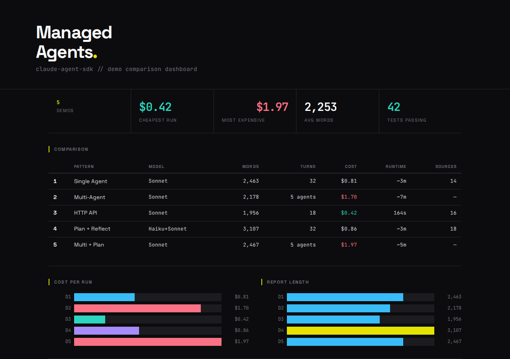
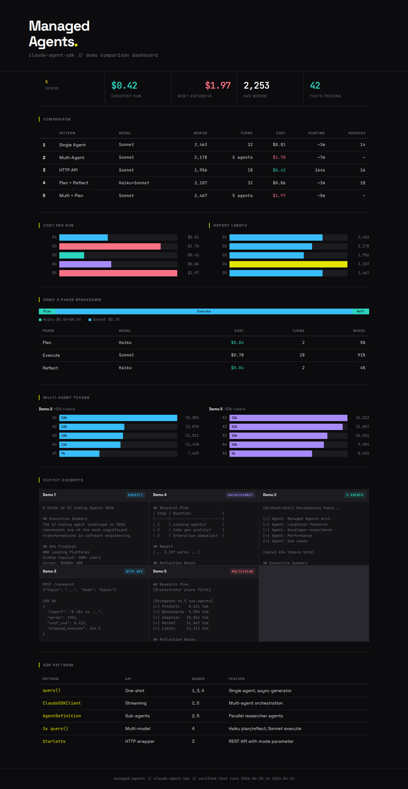
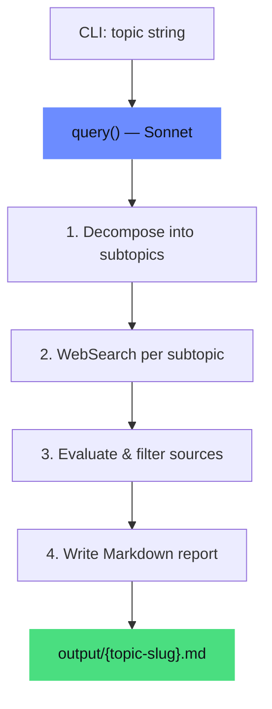
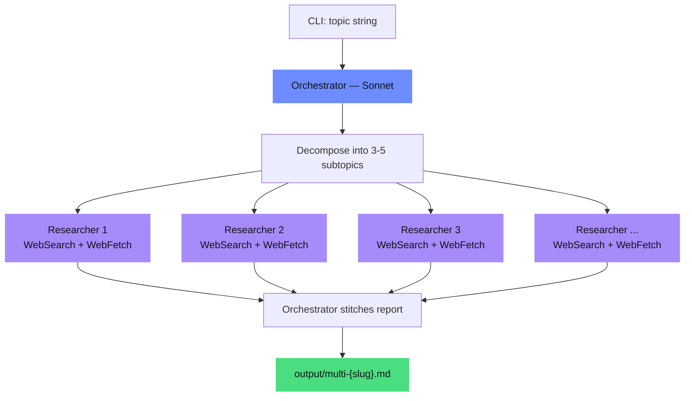
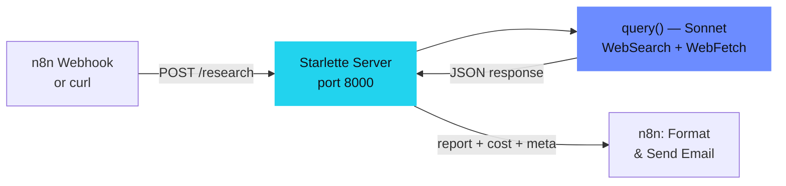
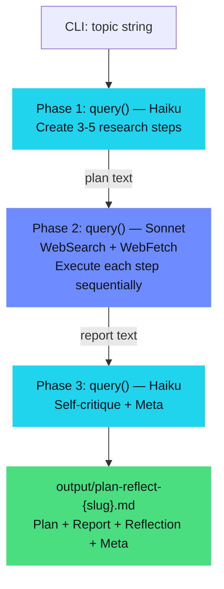
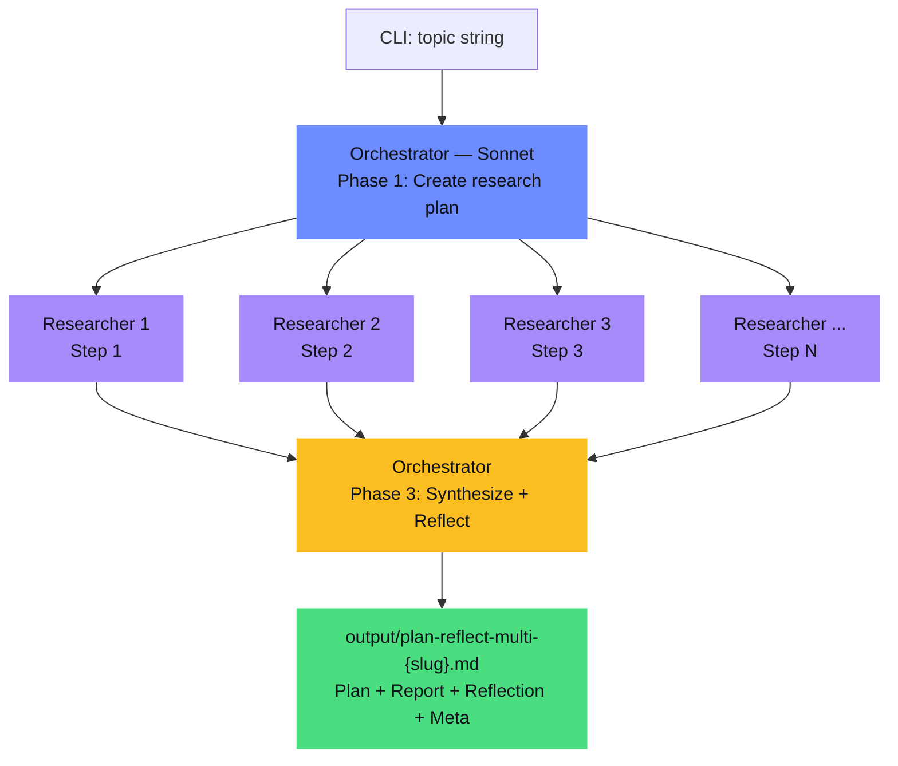

# Managed Agents — Research Agent

[](https://docs.anthropic.com/en/docs/agents-and-tools/claude-code/sdk-overview)
[](#cost-verified)
[](#testing)
[](#setup)
[](#docker)

**Autonomous research agents that plan, execute, and self-critique.** Five demos showing progressively more sophisticated agent patterns with the [Claude Agent SDK](https://docs.anthropic.com/en/docs/agents-and-tools/claude-code/sdk-overview) — from single-agent one-shot to multi-agent orchestration with plan-and-execute + reflection. Reports average 2,253 words with 8-18 verified sources, costs $0.42-$1.97 per run.

## Table of Contents

- [Demos Overview](#demos-overview) — all 5 demos at a glance
- [Demo 1: Single Agent](#demo-1-simple-research-agent) — one-shot `query()`
- [Demo 2: Multi-Agent](#demo-2-multi-agent-research) — parallel sub-agents
- [Demo 3: HTTP API](#demo-3-n8n-hybrid) — Starlette server + n8n
- [Demo 4: Plan + Reflect](#demo-4-plan--reflect-research-agent) — Haiku plan, Sonnet execute, Haiku reflect
- [Demo 5: Multi + Plan](#demo-5-multi-agent-plan--reflect) — orchestrator + sub-agents + reflection
- [Comparison Runner](#comparison-runner) — Demo 1 vs Demo 4 side-by-side
- [Dashboard](#comparison-dashboard) — visual HTML comparison
- [Testing](#testing) — 42 pytest tests, no API calls
- [Docker](#docker) — containerized Demo 3
- [Cost](#cost-verified) — verified run costs
- [Project Structure](#project-structure)

## Demos Overview

| Demo | Script | Pattern | Description |
|------|--------|---------|-------------|
| [1](#demo-1-simple-research-agent) | `research_agent.py` | Single agent | One agent researches topic end-to-end |
| [2](#demo-2-multi-agent-research) | `multi_agent_research.py` | Multi-agent | Orchestrator spawns parallel sub-agents per subtopic |
| [3](#demo-3-n8n-hybrid) | `n8n_hybrid_server.py` | HTTP API + n8n | Webhook triggers research, n8n formats and emails |
| [4](#demo-4-plan--reflect-research-agent) | `plan_reflect_agent.py` | Plan + Reflect | Structured planning, sequential execution, self-critique |
| [5](#demo-5-multi-agent-plan--reflect) | `plan_reflect_multi_agent.py` | Multi + Plan | Orchestrator plans, delegates to sub-agents, reflects |
| — | `run_comparison.py` | Comparison | Runs Demo 1 vs Demo 4 side-by-side on same topic |

## Prerequisites

- **Python 3.12+**
- **Claude Code CLI** installed and authenticated (`npm install -g @anthropic-ai/claude-code`)
- **Anthropic API access** (the CLI handles authentication — no manual API key export needed)
- **n8n** (optional, for Demo 3 email workflow) — v2.11+ installed locally

## Setup

```bash
cd ~/projects/managed-agent-poc

# Create and activate virtual environment
python3 -m venv venv
source venv/bin/activate

# Install dependencies
pip install -r requirements.txt
```

## Testing

Unit tests for shared utilities, system prompt structure, and output parsing. All tests run locally without API calls.

```bash
source venv/bin/activate
pytest tests/ -v
```

42 tests covering:
- `test_utils.py` — slugify, strip_preamble, check_report_structure, config constants
- `test_prompts.py` — validates BASIC/PLAN_REFLECT/RESEARCHER prompt structure
- `test_output_parsing.py` — report section detection, meta-info parsing, source URL extraction

## Comparison Dashboard

Visual HTML dashboard comparing all demos side-by-side with charts and sample outputs:

```bash
cd static && python3 -m http.server 8080
# Open http://localhost:8080/comparison.html
```

Or open `static/comparison.html` directly in a browser.





---

## Demo 1: Simple Research Agent

Single agent that researches a topic autonomously and produces a structured Markdown report.

### Architecture



### Usage

```bash
python3 research_agent.py "State of AI Coding Agents 2026"
python3 research_agent.py "KI-Telefonie im DACH-Mittelstand" -o reports/
```

| Flag | Default | Description |
|------|---------|-------------|
| `topic` (positional) | *required* | The topic to research |
| `-o`, `--output-dir` | `output/` | Directory to save the report |

### Verified Test Results

| Metric | Value |
|--------|-------|
| Report length | 2,463 words |
| Sources | 14 verified URLs |
| Agent turns | 32 |
| Cost | $0.81 |
| Runtime | ~3 minutes |

Tested with topic "State of AI Coding Agents 2026" on 2026-04-10.

---

## Demo 2: Multi-Agent Research

Orchestrator agent decomposes the topic into subtopics and spawns parallel sub-agents — each researching one subtopic independently. Results are stitched into a unified report.

### Architecture



### Usage

```bash
python3 multi_agent_research.py "Claude Managed Agents vs LangChain"
python3 multi_agent_research.py "RAG Architekturen 2026" -o reports/
```

| Flag | Default | Description |
|------|---------|-------------|
| `topic` (positional) | *required* | The topic to research |
| `-o`, `--output-dir` | `output/` | Directory to save the report |

### How It Works

1. **Orchestrator** receives the topic and decomposes it into 3-5 subtopics
2. For each subtopic, spawns a **researcher sub-agent** via the Agent tool
3. Sub-agents run in parallel, each using WebSearch/WebFetch independently
4. Progress tracked via `TaskStartedMessage` and `TaskNotificationMessage`
5. Orchestrator collects all results and writes the final unified report
6. Per-agent token breakdown printed to stdout

### Verified Test Results

| Metric | Value |
|--------|-------|
| Report length | 2,178 words |
| Sub-agents spawned | 5 (parallel) |
| Total tokens | ~65,000 across all agents |
| Cost | $1.70 |
| Runtime | ~7 minutes |

Tested with topic "Claude Managed Agents vs LangChain" on 2026-04-10.

**Sub-agent breakdown from test run:**
| Sub-agent | Tokens |
|-----------|--------|
| Claude Managed Agents architecture | 22,081 |
| LangChain architecture and features | 7,429 |
| Developer experience comparison | 11,440 |
| Performance and production readiness | 12,076 |
| Use cases and adoption trends | 11,811 |

### Key Difference from Demo 1

Demo 1 uses `query()` (one-shot, single agent). Demo 2 uses `ClaudeSDKClient` (streaming, bidirectional) with `AgentDefinition` to define sub-agents that the orchestrator can spawn.

---

## Demo 3: n8n Hybrid

HTTP API server that any client (n8n, curl, Postman) can call to trigger research. Includes an importable n8n workflow that receives a webhook, calls the API, formats the report, and sends it via email.

**Shows: "n8n + Managed Agents = complementary, not competitive"**

### Architecture



### Usage

**Start the server:**

```bash
python3 n8n_hybrid_server.py              # Default: port 8000
python3 n8n_hybrid_server.py --port 9000  # Custom port
```

**Test with curl:**

```bash
# Health check
curl http://localhost:8000/health

# Trigger research — basic mode (default, ~3 minutes)
curl -X POST http://localhost:8000/research \
     -H "Content-Type: application/json" \
     -d '{"topic": "AI Coding Agents 2026"}'

# Trigger research — plan-reflect mode (~2 minutes)
curl -X POST http://localhost:8000/research \
     -H "Content-Type: application/json" \
     -d '{"topic": "AI Coding Agents 2026", "mode": "plan-reflect"}'
```

### API Endpoints

#### `POST /research`

Triggers autonomous research on a topic.

**Request:**
```json
{"topic": "State of AI Coding Agents 2026", "mode": "basic"}
```

| Field | Required | Default | Description |
|-------|----------|---------|-------------|
| `topic` | yes | — | The topic to research |
| `mode` | no | `"basic"` | `"basic"` (Demo 1 prompt) or `"plan-reflect"` (Demo 4 prompt with plan + reflection) |

**Response (from actual test run):**
```json
{
  "topic": "n8n vs Make.com vs Zapier 2026",
  "mode": "basic",
  "report": "# n8n vs Make.com vs Zapier: 2026 Automation Platform Comparison\n...",
  "words": 1956,
  "turns": 18,
  "cost_usd": 0.415,
  "elapsed_seconds": 164.5
}
```

#### `GET /health`

Returns `{"status": "ok", "service": "research-agent"}`.

### n8n Workflow Setup

1. Import `n8n_workflow.json` into n8n (Settings → Import Workflow)
2. Configure SMTP credentials in the "Send Email" node
3. Set `EMAIL_FROM` and `EMAIL_TO` environment variables (or edit the node directly)
4. Ensure the Python server is running on `localhost:8000`
5. Activate the workflow — the webhook is ready at `POST /webhook/research`

**Workflow flow:** Webhook Trigger → HTTP Request (calls Python API) → Format Report → Send Email + Respond to Webhook

| Server Flag | Default | Description |
|-------------|---------|-------------|
| `--port` | `8000` | Port to listen on |
| `--host` | `0.0.0.0` | Host to bind to |

---

## Demo 4: Plan & Reflect Research Agent

Three separate `query()` calls using the optimal model per phase. Planning and reflection use Haiku (10x cheaper), execution uses Sonnet (needs reasoning quality).

**Inspired by:** Plan-and-Execute and Reflection patterns from the LangGraph ecosystem.

### Architecture



### Usage

```bash
python3 plan_reflect_agent.py "State of AI Coding Agents 2026"
python3 plan_reflect_agent.py "RAG Architekturen 2026" -o reports/
```

| Flag | Default | Description |
|------|---------|-------------|
| `topic` (positional) | *required* | The topic to research |
| `-o`, `--output-dir` | `output/` | Directory to save the output |

### Output Structure

Unlike Demo 1 which outputs only the report, Demo 4 outputs a complete research artifact:

1. **Research Plan** — Table of planned steps with questions and target sources
2. **Report** — Executive Summary, Key Findings, Sources, Conclusions (same structure as Demo 1)
3. **Reflection Notes** — Self-critique: plan coverage, source quality, contradictions, overall assessment
4. **Meta** — Step count, web search count, whether reflection triggered a correction

### Example Output (Plan + Reflection sections)

```markdown
## Research Plan

| Step | Research Question | Target Source Type |
|------|------------------|--------------------|
| 1 | What are the leading AI coding agents in 2026? | News, official docs |
| 2 | How do they compare on code generation quality? | Benchmarks, papers |
| 3 | What enterprise adoption patterns are emerging? | Industry reports |
| 4 | What are the key limitations and risks? | Expert analyses |

## Report
[... standard report content ...]

## Reflection Notes

1. **Plan Coverage**: All 4 steps adequately addressed. Step 3 (enterprise adoption)
   had fewer primary sources than ideal.
2. **Source Quality**: 12 sources, mostly authoritative. 2 blog posts are weaker but
   corroborated by other sources.
3. **Contradictions**: Benchmark results vary by provider — noted in findings.
4. **Overall Assessment**: Adequate

## Meta

- **Research steps planned**: 4
- **Research steps completed**: 4
- **Total web searches performed**: 11
- **Reflection triggered correction**: No
- **Correction details**: N/A
```

### Verified Test Results

**v2 (multi-model: Haiku plan/reflect + Sonnet execute)** — 2026-04-14:

| # | Topic | Words | Turns | Cost | Plan $ | Exec $ | Reflect $ | Correction |
|---|-------|-------|-------|------|--------|--------|-----------|------------|
| 1 | State of AI Coding Agents 2026 | 3,107 | 32 | $0.86 | $0.04 | $0.78 | $0.04 | Yes |
| 2 | n8n vs Make.com vs Zapier 2026 | 2,956 | 26 | $0.65 | $0.01 | $0.61 | $0.03 | No |

**Haiku cost for Plan+Reflect**: $0.04-0.08 per run (vs ~$0.15-0.20 with Sonnet for those phases).

<details>
<summary>v1 results (single Sonnet, 2026-04-13)</summary>

| # | Topic | Words | Turns | Cost | Correction |
|---|-------|-------|-------|------|------------|
| 1 | State of AI Coding Agents 2026 | 2,338 | 25 | $0.60 | No |
| 2 | n8n vs Make.com vs Zapier 2026 | 2,145 | 18 | $0.50 | No |
| 3 | KI-Telefonie im DACH-Mittelstand | 2,176 | 32 | $0.82 | No |
| 4 | Claude Managed Agents vs LangChain | 2,588 | 30 | $0.53 | No |
| 5 | RAG Architekturen 2026 | 1,823 | 20 | $0.57 | No |

</details>

### Key Differences from Demo 1

| Aspect | Demo 1 (Basic) | Demo 4 (Plan + Reflect) |
|--------|----------------|-------------------------|
| Approach | "Research this topic" one-shot | Structured plan → sequential execution → self-critique |
| Models | Sonnet only | Haiku (plan/reflect) + Sonnet (execute) |
| Planning | Implicit (agent decides internally) | Explicit plan output before any research |
| Evaluation | None — agent decides when done | Per-step sufficiency check during execution |
| Self-critique | None | Reflection phase with optional correction |
| Output | Report only | Plan + Report + Reflection + Meta |
| query() calls | 1 | 3 (one per phase) |

---

## Demo 5: Multi-Agent Plan & Reflect

Combines Demo 2's multi-agent orchestration with Demo 4's plan-and-execute + reflection. The orchestrator creates a research plan, delegates each step to parallel sub-agents, then synthesizes and reflects on the combined results.

### Architecture



### Usage

```bash
python3 plan_reflect_multi_agent.py "State of AI Coding Agents 2026"
python3 plan_reflect_multi_agent.py "RAG Architekturen 2026" -o reports/
```

### Verified Test Results

| Metric | Value |
|--------|-------|
| Report length | 2,467 words |
| Sub-agents spawned | 5 (parallel) |
| Total tokens | ~53,000 across all agents |
| Cost | $1.97 |
| Runtime | ~5 minutes |
| Structure (Plan/Reflection/Meta) | ✓/✓/✓ |

Tested with topic "State of AI Coding Agents 2026" on 2026-04-13.

**Sub-agent breakdown from test run:**
| Sub-agent | Tokens |
|-----------|--------|
| AI coding agent products 2026 | 8,631 |
| Capabilities/benchmarks 2026 | 9,904 |
| Enterprise adoption 2026 | 10,261 |
| Market landscape 2026 | 11,867 |
| Limitations and challenges 2026 | 12,312 |

---

## Comparison Runner

Runs Demo 1 (basic) and Demo 4 (plan+reflect) on the same topic sequentially and prints a side-by-side comparison table.

```bash
python3 run_comparison.py "State of AI Coding Agents 2026"
```

Outputs: comparison table to stdout + two report files (`compare-basic-*.md`, `compare-plan-reflect-*.md`).

### Verified Comparison Run

Topic: "n8n vs Make.com vs Zapier 2026" (2026-04-13):

| Metric | Demo 1 (basic) | Demo 4 (plan+reflect) |
|--------|---------------|----------------------|
| Words | 2,059 | 2,804 |
| Turns | 16 | 31 |
| Cost | $0.45 | $0.68 |
| Runtime | 153s | 233s |
| Has Research Plan | No | Yes |
| Has Reflection | No | Yes |
| Has Meta-info | No | Yes |

Total comparison cost: $1.13

---

## Shared Utilities

`utils.py` contains shared code used across all demos:

**Functions:**
- `slugify()` — filesystem-safe filename generation
- `strip_preamble()` — removes non-Markdown artifacts from agent output
- `check_report_structure()` — validates plan-reflect output sections

**System Prompts:**
- `BASIC_SYSTEM_PROMPT` — system prompt for Demo 1/3 (basic mode)
- `PLAN_REFLECT_SYSTEM_PROMPT` — system prompt for Demo 3 (plan-reflect mode)/4/5
- `RESEARCHER_PROMPT` — sub-agent prompt for Demo 2/5

**Configuration Constants:**
- `DEFAULT_MODEL` — `claude-sonnet-4-6` (single place to change model)
- `HAIKU_MODEL` — `claude-haiku-4-5-20251001` (used for plan/reflect phases)
- `DEFAULT_TOOLS` — `["WebSearch", "WebFetch"]`
- `DEFAULT_PERMISSION_MODE` — `bypassPermissions`

**Phase-Specific Prompts (Demo 4):**
- `PLAN_PHASE_PROMPT` — planning-only prompt for Haiku
- `EXECUTE_PHASE_PROMPT` — research execution prompt for Sonnet
- `REFLECT_PHASE_PROMPT` — self-critique prompt for Haiku

---

## Report Structure

All demos produce reports with this format:

- **Executive Summary** — 2-3 paragraph overview
- **Key Findings** — One subsection per subtopic with detailed analysis
- **Sources** — Numbered list with titles and URLs
- **Conclusions** — Synthesis of findings, trends, and implications

## Test Topics

| # | Topic | Expected Output | Tested |
|---|-------|-----------------|--------|
| 1 | "State of AI Coding Agents 2026" | ~2000 words, 10+ sources | Demo 1: 2,463w / Demo 4: 2,338w |
| 2 | "n8n vs Make.com vs Zapier 2026" | Comparison table + analysis | Demo 3: 1,956w / Demo 4: 2,145w |
| 3 | "KI-Telefonie im DACH-Mittelstand" | Market analysis, providers, ROI | Demo 4: 2,176w |
| 4 | "Claude Managed Agents vs LangChain" | Technical comparison | Demo 2: 2,178w / Demo 4: 2,588w |
| 5 | "RAG Architekturen 2026: Naive vs Graph vs Wiki" | Architecture guide | Demo 4: 1,823w |

## Key SDK Details

- **`query()`** for one-shot interactions (Demo 1, Demo 3 API, Demo 4)
- **`ClaudeSDKClient`** for streaming/multi-agent (Demo 2, Demo 5)
- **`AgentDefinition`** to declare sub-agents the orchestrator can spawn (Demo 2, Demo 5)
- Tool names are Claude Code built-ins: `WebSearch`, `WebFetch` (not `web_search`)
- All configuration centralized in `utils.py` (`DEFAULT_MODEL`, `DEFAULT_TOOLS`, `DEFAULT_PERMISSION_MODE`)
- Authentication handled by the `claude` CLI — no `ANTHROPIC_API_KEY` export needed

## Tech Stack

| Component | Version |
|-----------|---------|
| Python | 3.12 |
| claude-agent-sdk | 0.1.58 |
| anthropic | 0.93.0 |
| starlette | 1.0.0 |
| uvicorn | 0.44.0 |
| Claude Code CLI | 2.1.101 |
| n8n | 2.11.2 |
| Models | claude-sonnet-4-6 (execute), claude-haiku-4-5-20251001 (plan/reflect) |

## Cost (Verified)

All costs from actual test runs:

| Demo | Cost | Words | Runtime | Topic Tested | Date |
|------|------|-------|---------|--------------|------|
| Demo 1 | $0.81 | 2,463 | ~3 min | State of AI Coding Agents 2026 | 2026-04-10 |
| Demo 2 | $1.70 | 2,178 | ~7 min | Claude Managed Agents vs LangChain | 2026-04-10 |
| Demo 3 | $0.42 | 1,956 | 164s | n8n vs Make.com vs Zapier 2026 | 2026-04-10 |
| Demo 4 | $0.60 avg | 2,214 avg | ~2 min | 5 topics (see Demo 4 results) | 2026-04-13 |
| Demo 5 | $1.97 | 2,467 | ~5 min | State of AI Coding Agents 2026 | 2026-04-13 |

## Docker

Run the HTTP API server (Demo 3) in a container:

```bash
# Agent server only
docker compose up agent

# Agent server + n8n
docker compose --profile with-n8n up
```

The agent service builds from the included `Dockerfile` (Python 3.12-slim) and exposes port 8000. Set `ANTHROPIC_API_KEY` in your environment or `.env` file.

```bash
# Build and test
docker compose build
curl http://localhost:8000/health
```

## Project Structure

```
managed-agent-poc/
├── research_agent.py          # Demo 1: Simple Research Agent
├── multi_agent_research.py    # Demo 2: Multi-Agent Research
├── n8n_hybrid_server.py       # Demo 3: n8n Hybrid Server (supports mode=plan-reflect)
├── plan_reflect_agent.py      # Demo 4: Plan & Reflect Research Agent
├── plan_reflect_multi_agent.py # Demo 5: Multi-Agent Plan & Reflect
├── run_comparison.py          # Comparison runner (Demo 1 vs Demo 4)
├── utils.py                   # Shared utilities, prompts, config constants
├── requirements.txt           # Python dependencies
├── Dockerfile                 # Demo 3 container (Python 3.12-slim)
├── docker-compose.yml         # Agent + optional n8n services
├── n8n_workflow.json          # Demo 3: Importable n8n workflow
├── static/comparison.html     # Visual comparison dashboard (open in browser)
├── tests/                     # pytest test suite (42 tests)
├── output/                    # Generated reports
├── venv/                      # Python virtual environment
└── README.md
```

## License

Private project.
